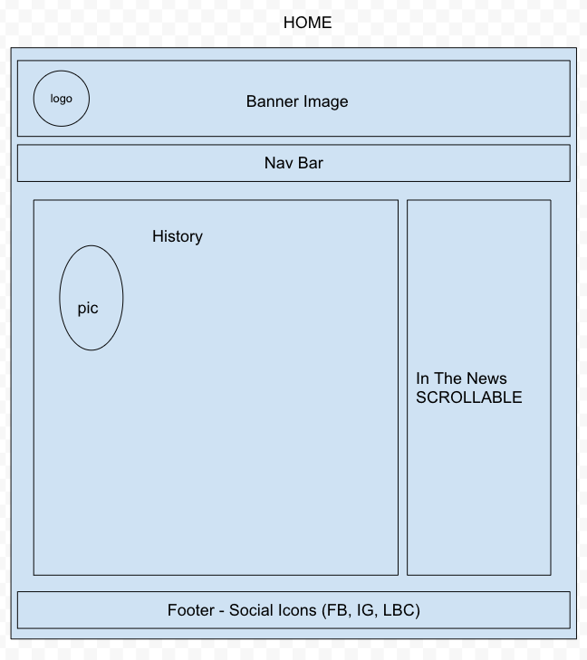
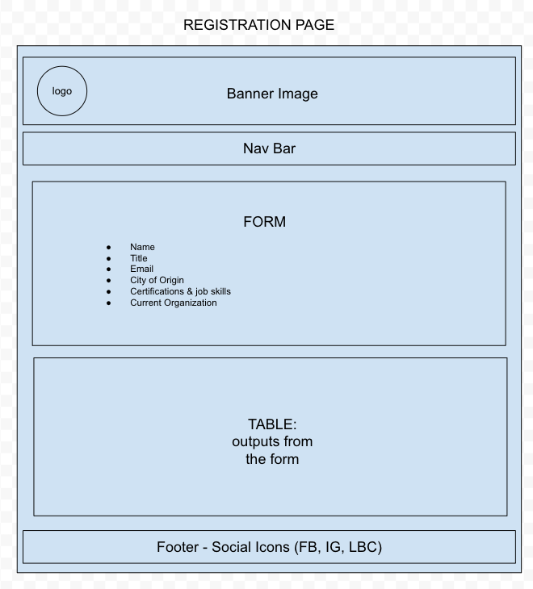
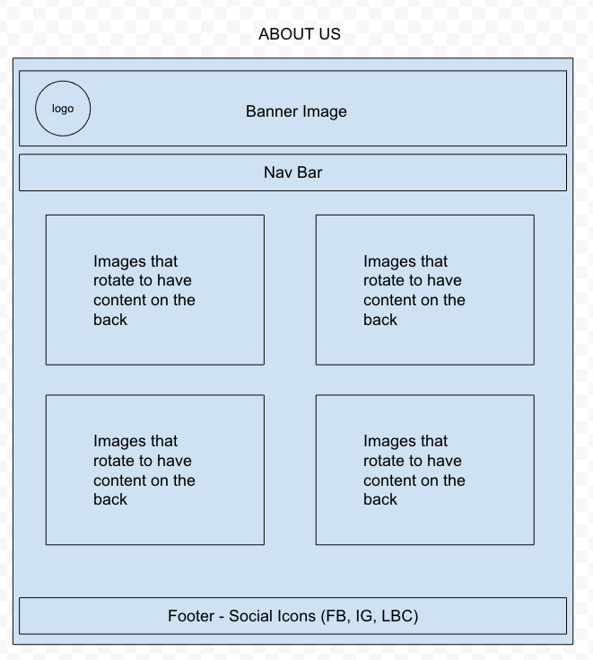
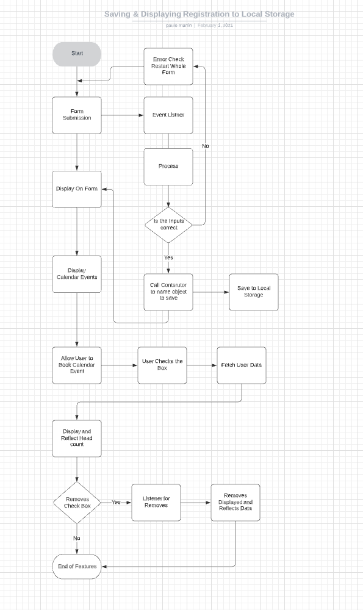

# PNNA

## Philippines Nursing Association (Approved by Jacob)  
* Summary of idea.
  * Concept: During the time of the pandemic our group would like to give back to our community front line medical worker. Recent data has shown that as the spread of covid-19 rises we as a nation are falling short on the necessary medical staff needed to combat this pandemic. Statistics showed that most hospital workers come from the nation of the Philippines. We have partnered up with the President Elect of the Philippines Nursing Association of Central California to produce a website to help nurses find a community
  * Goals: Create a network for immigrating nurses from the Philippines to receive, share, and communicate available resources. 
* What problem or pain point does it solve? a. Keep it high level without going into too much detail. (3-4 sentences is enough)
  * Helps immigrating nurses to find resources in the states as well as keep in touch with fellow immigrants.
* Minimum Viable Product (MVP) definition. What is the minimum required for you to present on your demo day?
  * Homepage with registration form
    * Basic information collected on form
    * Ideally have cultural/city specific connections between members to make sure they can get in touch with people from similar backgrounds. 
  * Resource page (Stretch Goal: add calendar with events)
    * Possible Event Lumpia Making Fundraiser
    * Social Media Account
  * About me

### Project Manager:  Lydia Minehan-Tubic
* Organize Documents/Information/Resources
* Mediating Meeting
* Direction/Tasking
* Confirm/Review Project Commits and Direction
* Manage Git Flow
* Submission person
### Code Review: Paulo Martin
* Optimize code
* Pull Pages Code and build routines to functions
* Break task down for code direction
* Layout code development plan
* Code Review and Log Errors
### Content Manager: R “Mal” Sweet
* Find pertinent content to fill the project
* Possibly create social media accounts to link to our project
* Research similar projects or “here’s what they did”
* Log minutes and notes of meeting to refer to
* Content word review 
* Vice Senior President in Technology reviewal process
### Designer: Victor Sullivan
* Build Intentional CSS Design
* Build Mockup WireFrame
* Find Content to Fill the page
* Write word content

## Wireframe
[Link to Google Draw project](https://docs.google.com/drawings/d/1yFRRmyZPcDGFpp_OiTwjbe65fXddZAPjOWDR_phBDqQ/edit)

Home

Registration

About Us

## User Stories
[link to meeting minutes document](https://docs.google.com/document/d/1TAA8ZmYki5M_oFUK_o9NOZUnQKBZGLTvyDg8M9N15M0/edit)
1. As a Philipino Nurse, I want a community of American immigrant Philipino nurses I can connect with, so that we can have support and create an environment for us to complete continued education and socialization
  * Reference: homepage, website
2. As a Philipino nurse, I want to be able to register via a standard form so I can connect with other Philipino nurses in my local community
  * References: form
3. s a user, I want to see a members list table that shows other nurses that have already registered on the website so I can make connections with them
  * References: table with members list
4. As a user I want to be able to find community events via a community event calendar (stretch goal) or links to social media
  * References: social media and calendar (stretch goal)
5. As a user I want to be able to connect with others who share my background by having information on the site about regions from the Philippines other American immigrant nurses are from 
  * Reference: specific in form, specifics in members list table, homepage, website

## Domain Modeling
[link to lucid board](https://lucid.app/lucidchart/47f885e8-173f-49c3-b82f-0579baa63eb9/edit?docId=47f885e8-173f-49c3-b82f-0579baa63eb9&shared=true&page=0_0#?folder_id=home&browser=icon)

